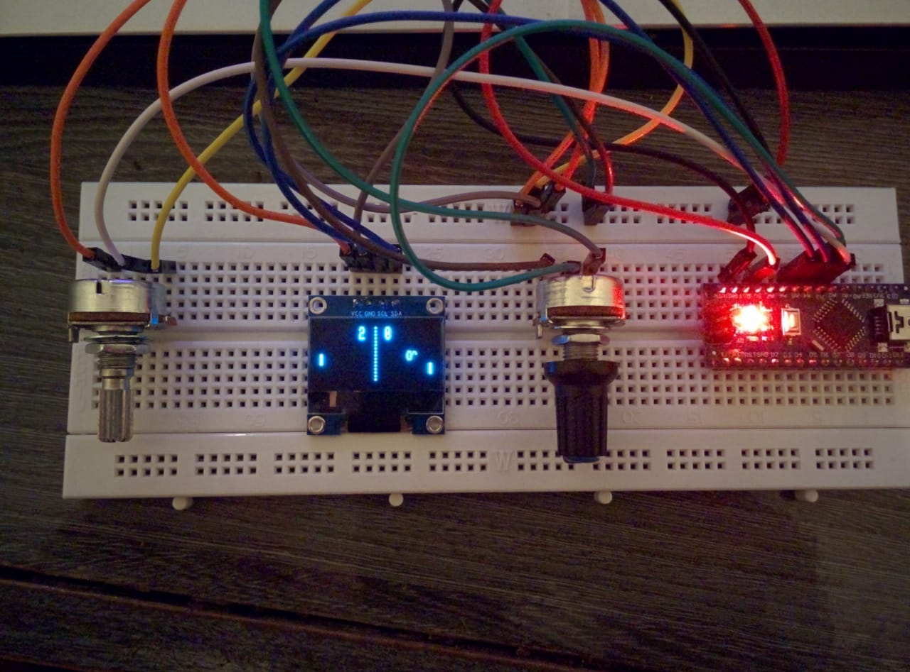

# Jogo Pong Arduino 2 Players
Projeto feito para a matéria eletrônica para computação 

Jogo de pong criado utilizando um arduino e OLED display. 

Possui dois potenciometros utilizados como controle de cada player.

